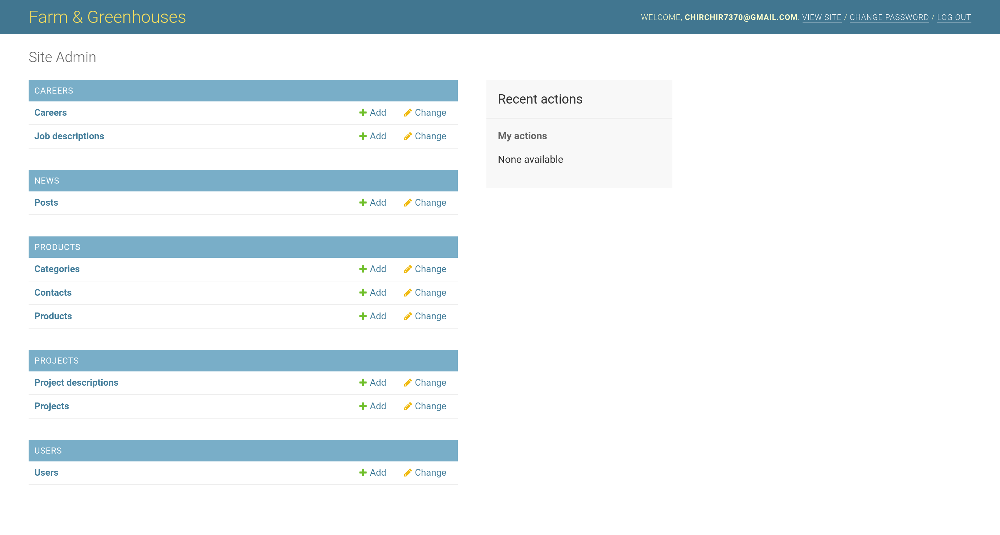
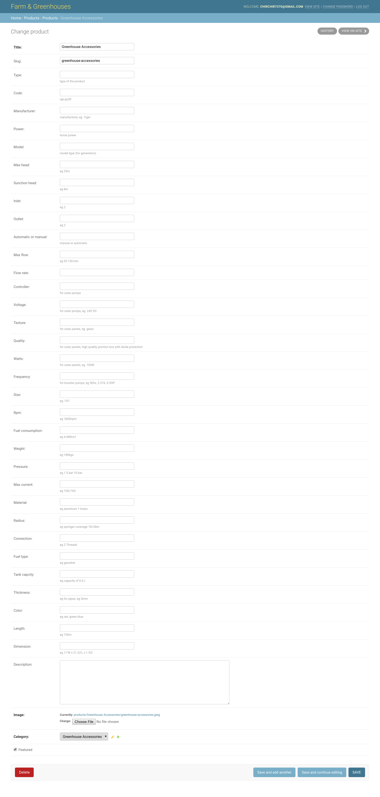
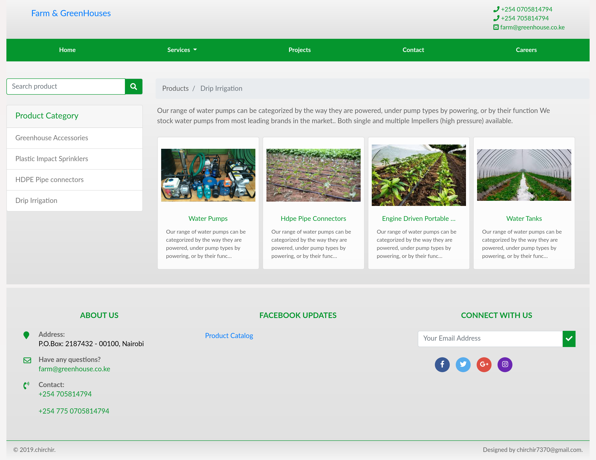
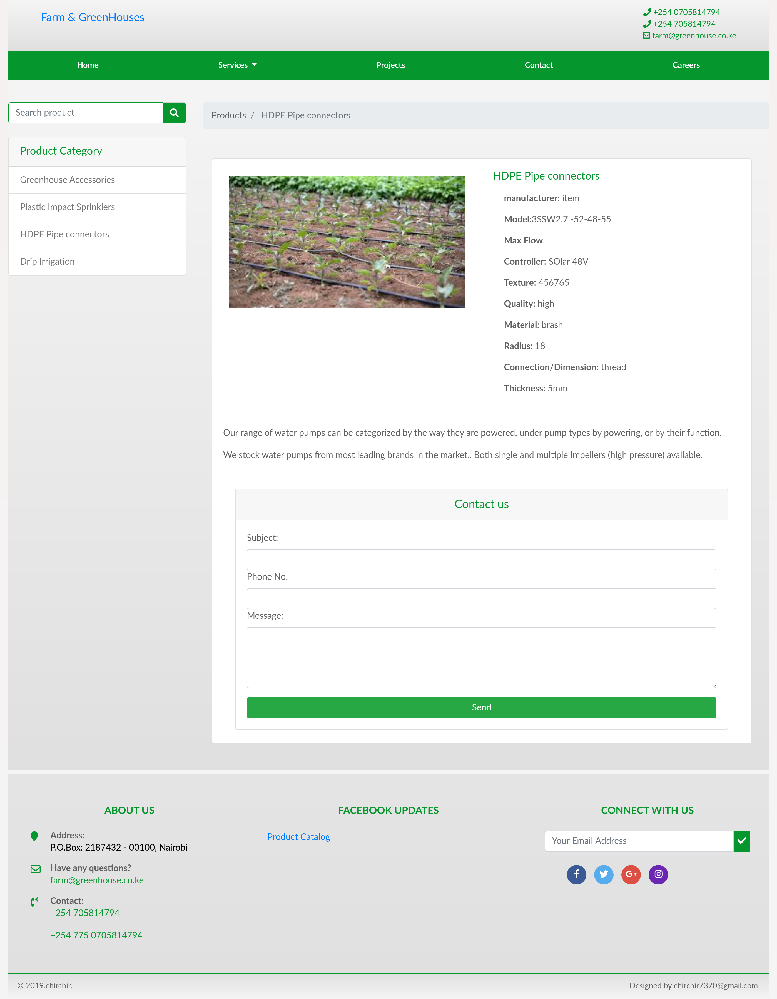
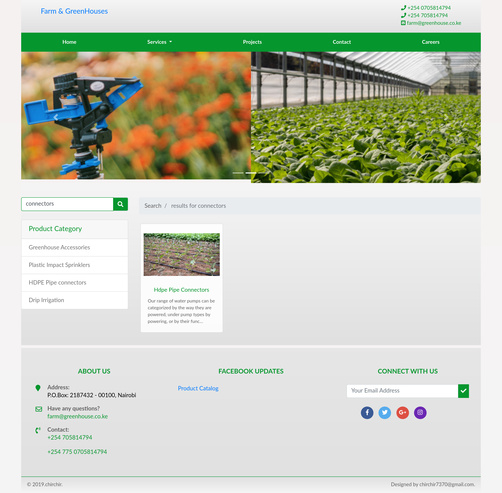

#  Django Project: Farm & Greenhouse Catalogue
 This is a complete Farm and Greenhouse Project that is adaptable to other domains. It has Admin section to manage users, Add/Delete/update Product category, Add/Delete/Update Product belonging to specific category. the application also contain way to add projects and receive applications from career section. This application list product category and featured products on the home page. In the service section, search functionality is also implemented to list product based on search query.

## Achievements
1. create custom user model in django
2. Added Functionality to add product category 
3. Added functionality to add product and linked it to its category
4. managed to list featured products on Home page
5. Added functionality to search product based on search query 
6. List products per category 
7. Added functionality to get single product and allow users interested in that product to send quotation
8. Responsive to accomodate any screens size
9. Managed Authentications 
10. Manage image uploads in Django

## getting started
* ensure you have python3 installed
* ensure you have pip3 installed `sudo apt-get install python3-pip`
* ensure you have virtualenv installed `sudo apt-get install python3-pip`
* create virtual environment `virtualenv -p python3 myenv`
* activate virtual environment `source venv/bin/activate`
* clone repo `git clone https://github.com/chirchir12/farm-Greenhouse.git`
* move to assetManager directory `cd farm-Greenhouse`
* install dependencies `pip3 install -r requirements.txt`
* make migrations to avoid foreign key problems `python manage.py makemigrations users`
* migrate migrations `python manage.py migrate`
* start server `python manage.py runserver`
* go to the link `http://127.0.0.1:8000/`

## How to use 
* create superuser from terminal `python manage.py createsuperuser`
* enter email and password
* go to admin page `http://127.0.0.1:8000/admin`
* start by admin product category --as many as you like
* add product and select its category
* add projects 
* go to `http://127.0.0.1:8000/` and see results

## Author

##### follow me on

- Github: [@githubhandle](https://github.com/chirchir12)
- Twitter: [@twitterhandle](https://twitter.com/shadochir)
- Linkedin: [linkedin](https://www.linkedin.com/in/emmanuel-chirchir/)
- Email: [email](chirchir7370@gmail.com)

## Technologies used
* HTML5
* CSS3
* Bootstrap
* Python
* Django 
* Pillow
* Mysql
* JavaScript

## screenshots

### Home page

### Admin Dashboard

### add Product

### Product List

### Product Detail

### Search Product

## Contributions, issues and feature requests are welcome!

Feel free to check the [issues page](issues/).

## Show your support

Give a ⭐️ if you like this project!
